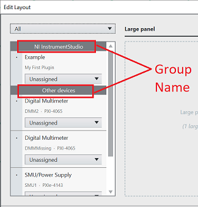
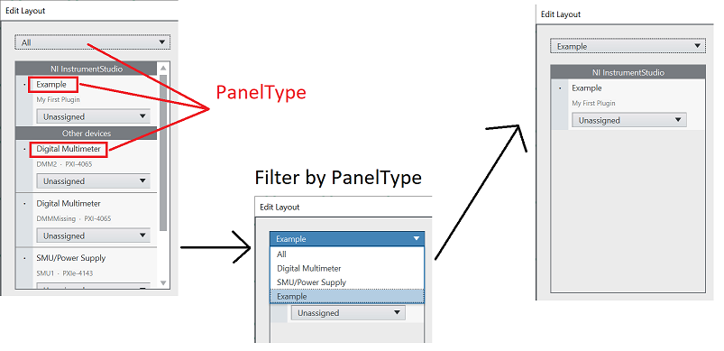
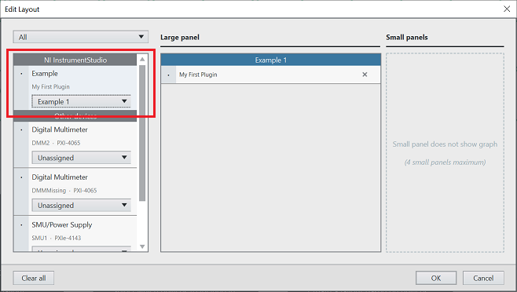
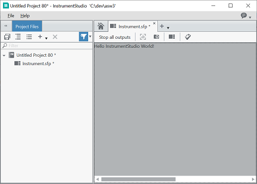

# Creating a C# Plugin for InstrumentStudio

This tutorial walks you through creating a simple C# plugin for InstrumentStudio from scratch. This plugin
has minimal functionality and is intended just to get you to a point where your plugin shows up and can
be put into a panel in InstrumentStudio. The plugin has no real functionality - the intent is to get you to
the point where you have a plugin that is building and running correctly as quickly as possible.

## Overview of the steps

- [Install InstrumentStudio](#install-instrumentstudio)
- [Get the .NET SDK](#get-the-net-sdk)
- [Create a C# Solution and Project](#create-a-c-solution-and-project)
- [Add Project References](#add-project-references)
- [Add the `ParticipatesInComposition` attribute](#add-the-participatesincomposition-attribute)
- [Implement the `PanelPlugin` Class](#implement-the-panelplugin-class)
- [Implement the `IPanelPluginFactory` Class](#implement-the-ipanelpluginfactory-class)
- [Optional: Delete the Class1.cs file](#optional-delete-the-class1cs-file)
- [Install the plugin](#install-the-plugin-assembly-into-instrumentstudio)
- [Test the plugin](#test-the-plugin)

## Install InstrumentStudio

This tutorial requires assemblies that are installed with InstrumentStudio. Install
InstrumentStudio with at least version 22.3.0.383-0+d383.

## Get the .NET SDK

You will need the .NET SDK and its command-line features in order to create the C# project
for the plugin. Install the latest Microsoft .NET 6.0 SDK from [this location](https://dotnet.microsoft.com/en-us/download).

## Create a C# Solution and Project

### Create a folder and a solution to contain your plugin

For this tutorial, we'll use **c:\myplugin** for this folder. From the command-line in **c:\myplugin**, run this command to create a solution

`dotnet new sln`

### Create a WPF library for the plugin

`dotnet new wpflib`

### Add the plugin library to the solution

`dotnet sln add .\myplugin.csproj`

Run `dotnet build` to ensure the plugin project is buildable at this point.

## Add Project References

Open the solution and open the myplugin.csproj file.

- Add a package reference for `System.ComponentModel.Composition` (the `PackageReference` element in the .csproj file below)
- Add a variable to point to the InstrumentStudio directory (the `InstrumentStudioDirectory` element in the .csproj file below)
- Add references to a couple of essential InstrumentStudio assemblies (the `Reference` elements in the .csproj file below)

Your .csproj file should look something like this:

```xml
<Project Sdk="Microsoft.NET.Sdk">
  <PropertyGroup>
    <UseWPF>true</UseWPF>
    <TargetFramework>net6.0-windows</TargetFramework>
  </PropertyGroup>
  <PropertyGroup>
    <InstrumentStudioDirectory>C:/Program Files/National Instruments/InstrumentStudio</InstrumentStudioDirectory>
  </PropertyGroup>
  <ItemGroup>
    <PackageReference Include="System.ComponentModel.Composition" Version="6.0.0" />
  </ItemGroup>
  <ItemGroup>
    <Reference Include="NationalInstruments.Core">
      <HintPath>$(InstrumentStudioDirectory)\NationalInstruments.Core.dll</HintPath>
    </Reference>
    <Reference Include="NationalInstruments.InstrumentFramework.Plugins">
      <HintPath>$(InstrumentStudioDirectory)\NationalInstruments.InstrumentFramework.Plugins.dll</HintPath>
    </Reference>
  </ItemGroup>
</Project>
```

Run `dotnet build` to ensure the plugin project is buildable at this point.

## Add the ParticipatesInComposition Attribute

In order to be correctly recognized by InstrumentStudio, assemblies need to have an assembly attribute called `ParticipatesInComposition`.

Add a .cs file to the project directory to contain the `ParticipatesInComposition` attribute. This is traditionally stored
in a file called AssemblyInfo.cs, but any .cs file that is compiled into the project should work. By default, for .NET projects, any .cs file placed in the project directory will be compiled by default. So simply create the AssemblyInfo.cs file in the project directory with the contents below.

```csharp
using NationalInstruments.Composition;

[assembly: ParticipatesInComposition]
```

Run `dotnet build` to ensure the plugin project is buildable at this point.

## Implement the `PanelPlugin` Class

Create a new class in the project that inherits from `PanelPlugin`. This is the central class for
the plugin and an instance of it will be returned from the `IPanelPluginFactory` class in the next step.
The `PanelContent` property represents the main UI for your plugin. It can be any WPF [`FrameworkElement`](https://docs.microsoft.com/en-us/dotnet/api/system.windows.frameworkelement?view=windowsdesktop-6.0) - in this example,
we are simply returning a `TextBlock` as the minimal user interface element of our plugin.

```csharp
using NationalInstruments.InstrumentFramework.Plugins;
using System.Windows;
using System.Windows.Controls;

namespace NationalInstruments.InstrumentStudio.HelloWorldPlugin
{
    internal class MyPanelPlugin : PanelPlugin
    {
        public MyPanelPlugin(PluginSession pluginSession)
            : base(pluginSession)
        {
        }

        public override FrameworkElement PanelContent => new TextBlock { Text = "Hello InstrumentStudio World!" };
    }
}
```

Run `dotnet build` to ensure the plugin project is buildable at this point.

## Implement the `IPanelPluginFactory` Class

Create a new class in the project the implements the `IPanelPluginFactory` interface. The key elements here are:

- The class is decorated with the `ExportPanelPlugin` attribute. This tells the framework about the plugin
in general terms including its 'DisplayName' and other 'metadata' information.
- The class implements the `IPanelPluginFactory` interface. This interface contains the `CreatePlugin` method.
- The `CreatePlugin` method is called by the framework and returns an instance of your class that inherits from the `PanelPlugin` abstract base class.
- The GroupName and PanelType determine how the plugin appears in the Edit Layout dialog in InstrumentStudio. See the images below.





```csharp
using NationalInstruments.InstrumentFramework.Plugins;

namespace NationalInstruments.InstrumentStudio.HelloWorldPlugin
{
    [ExportPanelPlugin(DisplayName, UniqueName, GroupName, PanelType, SupportedPresentations)]
    public class MyPanelPluginFactory : IPanelPluginFactory
    {
        public const string DisplayName = "My First Plugin";
        public const string UniqueName = "NI | CSharpPlugin | My Plugin";
        public const string GroupName = "NI InstrumentStudio";
        public const string PanelType = "Example";
        public const PanelPresentation SupportedPresentations = PanelPresentation.ConfigurationWithVisualization | PanelPresentation.ConfigurationOnly;

        public PanelPlugin CreatePlugin(PluginSession pluginSession)
            => new MyPanelPlugin(pluginSession);
    }
}
```

Run `dotnet build` to ensure the plugin project is buildable at this point.

## Optional: Delete the Class1.cs file

When the library was created, .NET put an initial Class1.cs file into the project directory.
This file is unneeded and can be deleted if you wish.

## Install the plugin assembly into InstrumentStudio

Copy the myplugin.dll from the built assembly directory (bin\Debug\net6.0-windows) to the Addons folder of InstrumentStudio
(C:\Program Files\National Instruments\InstrumentStudio\Addons). It can be anywhere under this directory including a sub-folder.

## Test the Plugin

Run InstrumentStudio. NOTE: Relaunch InstrumentStudio if it is already running to detect new plugins. From the lobby screen in InstrumentStudio, click the 'Manual Layout' button. You will see the 'Edit Layout' dialog with your new plugin listed there:



Create a large panel for the plugin and click OK. You will see a soft front panel with your plugin UI in it
similar to this:


