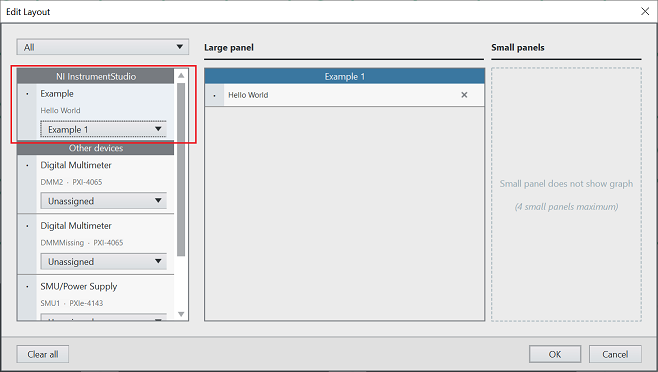
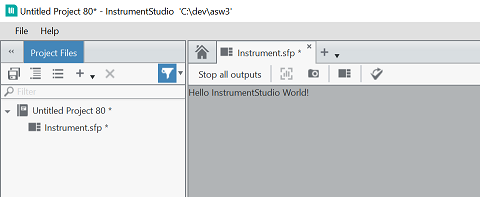

# Hello World C# InstrumentStudio Plug-In

This is a minimal example of a C# plug-in for InstrumentStudio.

## Dependencies

This plug-in requires InstrumentStudio 2022 Q3 or later.

Building this plug-in requires the Microsoft .NET 6.0 SDK. You can download the
latest from [this location](https://dotnet.microsoft.com/en-us/download).

## Building

To build the plug-in, run this command from the 'csharp/examples/helloworld' directory:

```
dotnet build
```

The default project settings assume that InstrumentStudio is installed in the
default location. If InstrumentStudio is installed in a custom location or is not installed, you
can specify a custom path to the InstrumentStudio assemblies by setting the
`InstrumentStudioDirectory` environment variable or editing the corresponding variable in
`HelloWorld.NetCore.csproj`.

Building InstrumentStudio C# plug-ins requires the following assemblies from the
InstrumentStudio directory:

- `NationalInstruments.Core.dll`
- `NationalInstruments.InstrumentFramework.Plugins.dll`

## Installation

Copy the built assembly (`NationalInstruments.HelloWorldPlugin.dll`) into the InstrumentStudio `Addons`
directory, which is `C:\Program Files\National Instruments\InstrumentStudio\Addons` by default.

You may optionally install the plug-in assembly into a subdirectory of the `Addons` directory
in order to isolate it from other plug-ins.

If the plug-in is installed correctly, it will appear in the Edit Layout dialog in InstrumentStudio:



The panel looks like this in InstrumentStudio once it is created:

