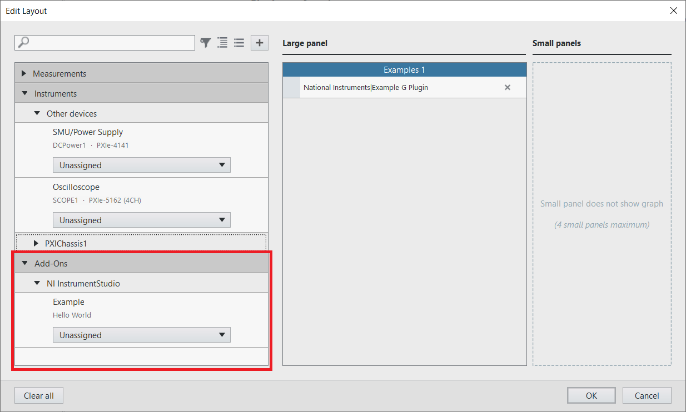

# Hello World C# InstrumentStudio Plugin

This example shows a minimal C# plugin example that can be used with InstrumentStudio

## Dependencies

### InstrumentStudio

This example requires assemblies that are installed with InstrumentStudio. You must install
InstrumentStudio in order to build this plugin. This requires a development version
of InstrumentStudio 22.3 at least version 22.3.0.383-0+d383.

### .NET SDK

In order to build, you must install the Microsoft .NET 6.0 SDK. You can download the
latest from [this location](https://dotnet.microsoft.com/en-us/download).

## Building

### Update the InstrumentStudio location in the .csproj file

Update this line to reflect the location where InstrumentStudio is installed.
`<InstrumentStudioDirectory>C:\Program Files\National Instruments\InstrumentStudio</InstrumentStudioDirectory>`

This location provides these assemblies needed to build:

- `NationalInstruments.Core.dll`
- `NationalInstruments.InstrumentFramework.Plugins.dll`

### Build the plugin

To build the example, run this command from the 'csharp/examples/helloworld' directory:

`dotnet build`

## Installation

Copy the built assembly (NationalInstruments.HelloWorldPlugin.dll) into the 'Addons' directory under InstrumentStudio, for example "C:\Program Files\National Instruments\InstrumentStudio\Addons". The assembly can also be located in a sub-folder under the Addons directory if you want to isolate it from other plugins.

If the plugin is installed correctly, it will appear in the Edit Layout dialog in InstrumentStudio

The panel looks like this in InstrumentStudio once it is created

