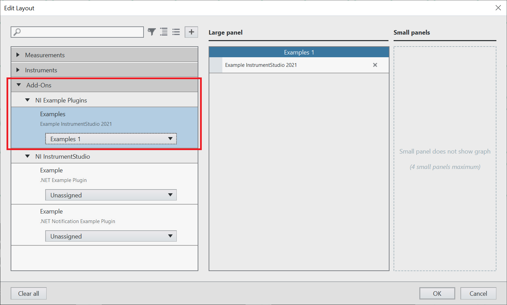
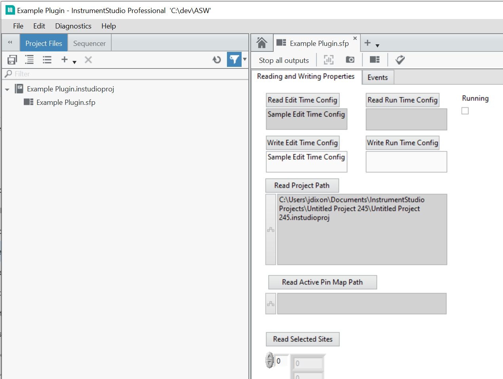

# Example LabVIEW InstrumentStudio Plug-In

This is a simple example of a LabVIEW plug-in for InstrumentStudio. It shows off
some of the basic features of LabVIEW plug-ins.

## Dependencies

This plug-in requires InstrumentStudio 2022 Q3 or later. It also requires the
InstrumentStudio Plug-In SDK to be installed.

## Installing the InstrumentStudio Plug-In SDK

Install the VI package for the InstrumentStudio Plug-In SDK
(`ni_instrumentstudio_plugin_sdk-1.0.0.1.vip`) which you can obtain from one of
the [Releases](https://github.com/ni/instrumentstudio-plugins/releases) from
this repo into the desired version of LabVIEW using the [VI Package
Manager](https://www.vipm.io/). LabVIEW 2021 and greater are supported.

## Building

* Open `ExamplePlugin.lvproj`
* Build the `Plugin Packed Library` build specification
  * Navigate to `Plugin Packed Library` under the `Build
    Specifications` folder in the project
  * Right-click on the build spec and choose `Build`

## Installation of the Plug-In

Copy the built plug-in files `ExamplePlugin.gplugindata` and
`ExamplePlugin.lvlibp` into the InstrumentStudio `Addons` directory, which is
`C:\Program Files\National Instruments\InstrumentStudio\Addons` by default.

You may optionally install the plug-in files into a subdirectory of the `Addons`
directory so its contents do not conflict with other plug-ins.

If the plug-in is installed correctly, it will appear in the Edit Layout dialog
in InstrumentStudio:

The panel looks like this in InstrumentStudio once it is created:

